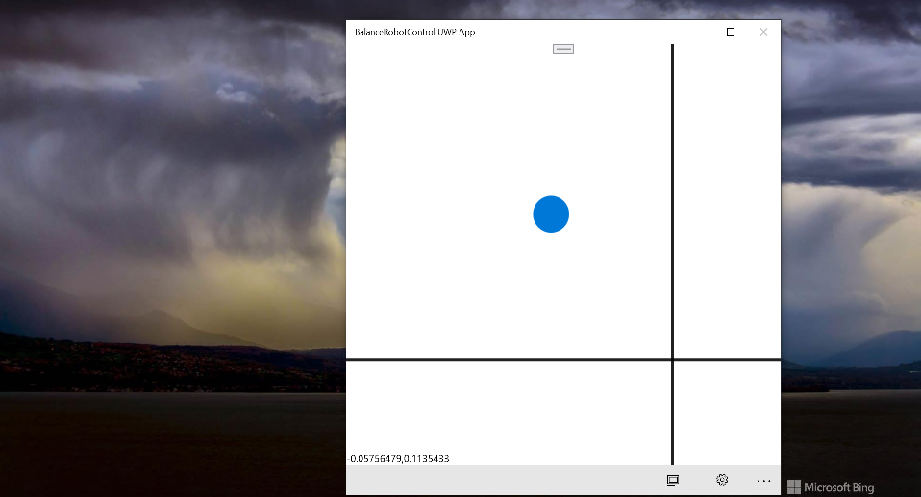

# BalanceRobotControlApp v1.0.1

BalanceRobotControl UWP App. Some Balancing Robot Controller. RnD only.

## Screenshots

## Features / Tech details
- Min. win os. build : 14393
- Win 10 Desktop + Mobile
- Bluetooth support
- bluetoothName = "RNBT-6DD3"

## My 2 cents

Transformed / Ported from WP 8.1 onto UWP 10.0.

UI adapted for Win 10 Mobile a little. 

## References
- https://github.com/ShelbyBoss/BalanceRobotControlApp
- https://create.arduino.cc/projecthub/mrinnovative01/diy-self-balancing-robot-a20fc6

## ..
AS IS. RnD only. Just for fun.

## .
[m][e] 2022

